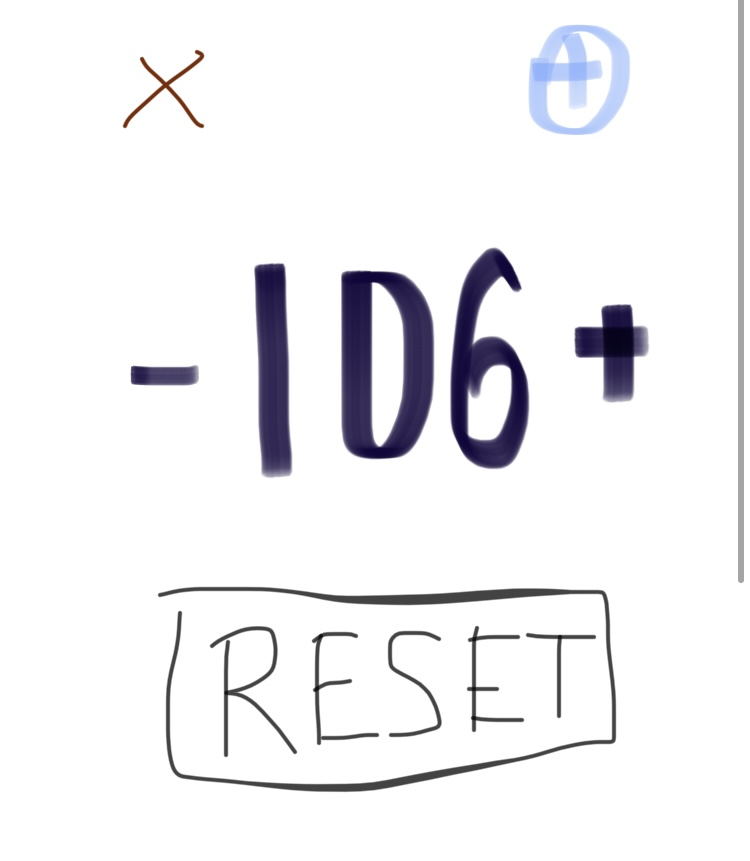
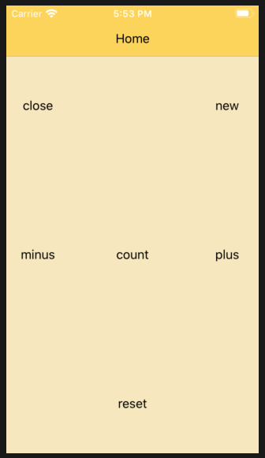

### Making a simple counter
1. a count
2. an increment
3. a decrement
4. a reset

and someday we might want to..

5. add a new counter
6. remove a counter

### Application layout
Since we have an image in mind, we can choose a layout  
Going to the layout document  

#### Grid Layout
looks similar to our concept:
https://nativescript-vue.org/en/docs/elements/layouts/grid-layout/#grid-layout-with-star-sizing

- we need 3 rows
	- the count is tall, so double the height
	- top and bottom rows the same height
	- `*, 2*, *`
- and 3 columns
	- count is wider, double the height
	- left and right side same width
	- `*, 2*, *`

- add labels as placeholders
	- one for each 'element' we expect to have
	- count from 0
	- determine the row, column position

our grid now looks like..  

### Adding elements
- a label
	- we'll need this for our count
	- for now - just a basic number
- some icons (up and down)
	- next to one another in the row
	- inside `<Label>`
	- how to change the icon size?
- a button
	- use the ns `<Button>` component
	- https://nativescript-vue.org/en/docs/elements/components/button/

### Positioning and style
- with Nativescript, we use the layout system to position
	- avoid using css to adjust position
	- will conflict with layout
- style is handled with our theming
	- changes just for the counter control in the components folder
		- use the style section
	- changes for the whole app
		- in the app.scss file
